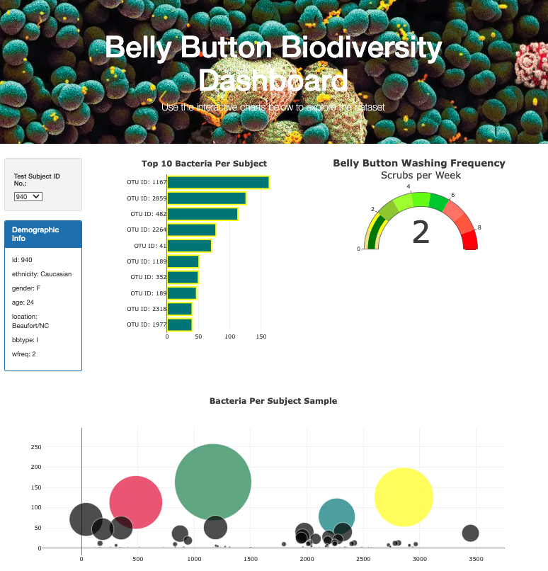

# Belly Button BioDiversity Dashboard

## Background
 This project reveals that a small handful of microbial species (also called operational taxonomic units, or OTUs, in the study) were present in more than 70% of people, while the rest were relatively rare. 

## Purpose
This project creates a web-based interactive dashboard that allows the end-user to visualize the counts and types of belly button bacteria found on volunteer subjects. To preserve anonymity, test subjects are cloned to a unique identification number. End-users use this number to select a subject from a dropdown list. Upon selection, the dashboard simultanesly displays the updated results on a group of graphs and charts.

## Website Link:https://g6-2flyy.github.io/Belly_Button_Biodiversity_Challenge/

## How it works:
* Step 1: Select a Subject ID number from the dropdown list
* Step 2: Observe or collect the updated demograpic information
* Step 3: Observe or collect the top 10 bacteria displayed on the bar graph
* Step 4: Observe or collect the updated wash frequency on the guage chart

## Technology Tools
* D3
* Javascript, HTML, CSS
* Plotly

